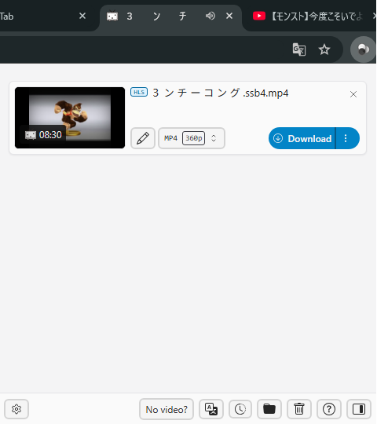
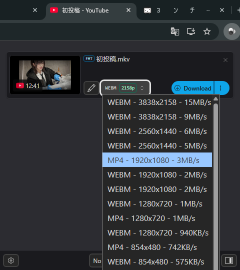

# FreeVDH

### [English Version Here (README.en.md)](README.en.md)

ウェブから動画をダウンロードするためのブラウザ拡張機能．

## 概要

FreeVDHは，Video DownloadHelper ([Chrome](https://chromewebstore.google.com/detail/video-downloadhelper/lmjnegcaeklhafolokijcfjliaokphfk?hl=ja) / [Firefox](https://addons.mozilla.org/ja/firefox/addon/video-downloadhelper/)) をベースにカスタマイズしたオープンソースプロジェクトで，ウェブページ上の動画を検出し，ダウンロードできるようにするChromiumベースのブラウザ拡張機能です．

<table><tr>
<td></td>
<td></td>
<td></td>
</tr></table>

## 機能

- ウェブページ上の動画を自動検出
- 複数フォーマット・品質でのダウンロード
- HLS / DASHストリーミングのダウンロード
- YouTubeを含む多数のサイトに対応
- BetterSmartNamingによるファイル名の自動整形
- ダウンロード履歴の管理
- サイドパネル / ポップアップの両モード対応
- ダウンロード回数・品質の制限なし

## インストール

1. このリポジトリをクローンまたはダウンロード
2. Chrome で `chrome://extensions` を開く
3. 「デベロッパーモード」を有効にする
4. 「パッケージ化されていない拡張機能を読み込む」をクリックし，このフォルダを選択

## ライセンス

MIT License
